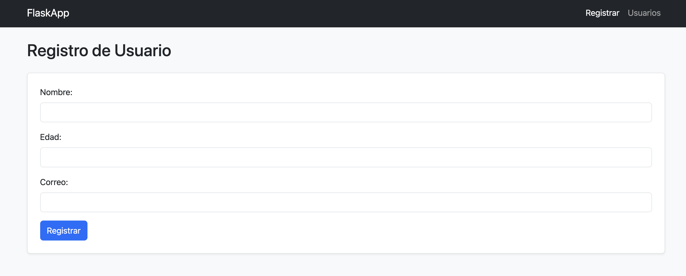

# 📋 Sistema de Registro de Usuarios con Flask

Este es un sistema web sencillo desarrollado con **Flask**, que permite registrar, listar, editar y eliminar usuarios. Utiliza **Bootstrap 5** para el diseño visual y **SQLite** como base de datos local.

---

## ✨ Características

- Registro de usuario (nombre, edad, correo)
- Lista de usuarios registrados
- Edición de registros existentes
- Eliminación con confirmación
- Mensajes emergentes (Flash)
- Plantilla base reutilizable con Bootstrap
- Navegación clara con barra de menú

---

## 🚀 Tecnologías utilizadas

- Python 3
- Flask
- Jinja2
- SQLite3
- Bootstrap 5
- HTML5 / CSS3

---

## 🖥️ Capturas de pantalla

*(Puedes agregar imágenes reales aquí si gustas)*

